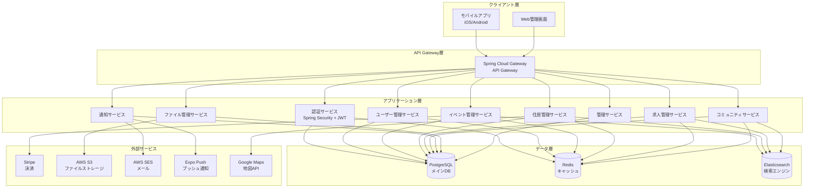
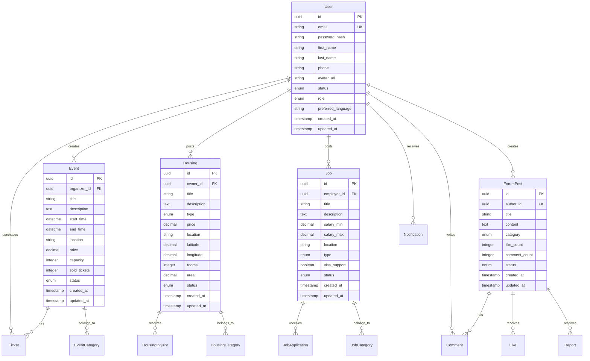
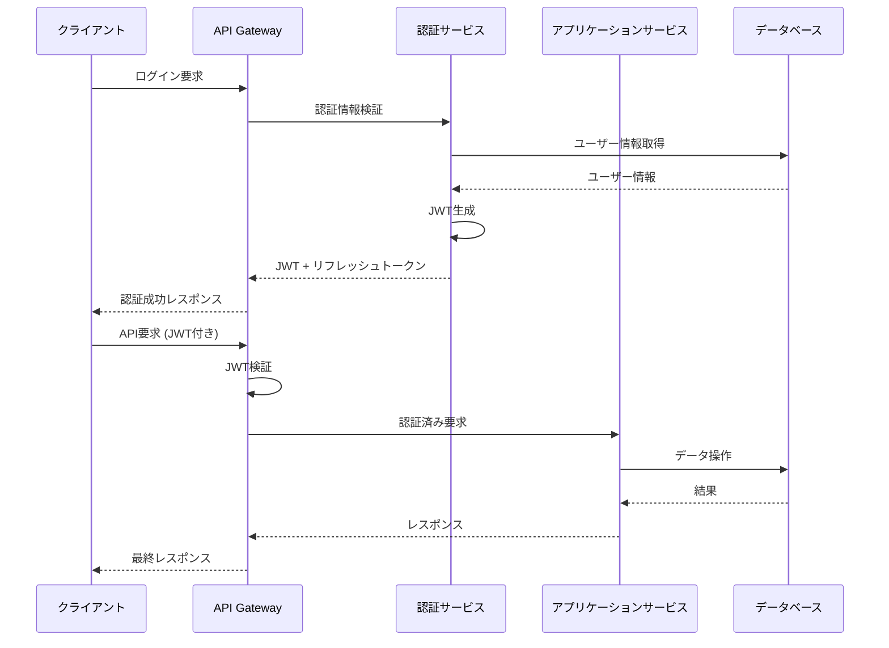

# 設計書

## 概要

本設計書は、日華（Rihua）コミュニティプラットフォーム向けのSpring Boot REST APIの技術設計を定義します。このAPIは、モバイルアプリケーション（iOS/Android）とWebベース管理システムの両方にサービスを提供し、認証、イベント管理、住居・求人検索、コミュニティフォーラム、通知システムなどの機能を実装します。

システムは高可用性、スケーラビリティ、セキュリティを重視し、マイクロサービスアーキテクチャパターンを採用してモジュラー設計を実現します。

## アーキテクチャ

### システム全体アーキテクチャ



### 技術スタック

- **フレームワーク**: Spring Boot 3.x
- **セキュリティ**: Spring Security 6.x + JWT
- **データベース**: PostgreSQL 15+
- **キャッシュ**: Redis 7+
- **検索エンジン**: Elasticsearch 8+
- **API Gateway**: Spring Cloud Gateway
- **ビルドツール**: Maven
- **Java バージョン**: Java 17+
- **コンテナ**: Docker + Docker Compose

## コンポーネントと インターフェース

### 1. 認証・認可コンポーネント

#### AuthController
```java
@RestController
@RequestMapping("/api/v1/auth")
public class AuthController {
    // POST /api/v1/auth/register - ユーザー登録
    // POST /api/v1/auth/login - ログイン
    // POST /api/v1/auth/refresh - トークン更新
    // POST /api/v1/auth/logout - ログアウト
    // POST /api/v1/auth/forgot-password - パスワードリセット
    // POST /api/v1/auth/social/login - ソーシャルログイン
}
```

#### JWTトークン構造
```json
{
  "sub": "user_id",
  "email": "user@example.com",
  "roles": ["USER", "BUSINESS"],
  "lang": "ja",
  "iat": 1640995200,
  "exp": 1640998800
}
```

### 2. ユーザー管理コンポーネント

#### UserController
```java
@RestController
@RequestMapping("/api/v1/users")
public class UserController {
    // GET /api/v1/users/profile - プロフィール取得
    // PUT /api/v1/users/profile - プロフィール更新
    // POST /api/v1/users/avatar - アバターアップロード
    // DELETE /api/v1/users/avatar - アバター削除
    // GET /api/v1/users/preferences - 設定取得
    // PUT /api/v1/users/preferences - 設定更新
}
```

### 3. イベント管理コンポーネント

#### EventController
```java
@RestController
@RequestMapping("/api/v1/events")
public class EventController {
    // GET /api/v1/events - イベント一覧取得
    // GET /api/v1/events/{id} - イベント詳細取得
    // POST /api/v1/events - イベント作成
    // PUT /api/v1/events/{id} - イベント更新
    // DELETE /api/v1/events/{id} - イベント削除
    // POST /api/v1/events/{id}/tickets/purchase - チケット購入
    // GET /api/v1/events/{id}/tickets - チケット一覧
}
```

### 4. 住居管理コンポーネント

#### HousingController
```java
@RestController
@RequestMapping("/api/v1/housing")
public class HousingController {
    // GET /api/v1/housing - 住居一覧取得
    // GET /api/v1/housing/{id} - 住居詳細取得
    // POST /api/v1/housing - 住居投稿
    // PUT /api/v1/housing/{id} - 住居更新
    // DELETE /api/v1/housing/{id} - 住居削除
    // POST /api/v1/housing/{id}/inquire - 問い合わせ
}
```

### 5. 求人管理コンポーネント

#### JobController
```java
@RestController
@RequestMapping("/api/v1/jobs")
public class JobController {
    // GET /api/v1/jobs - 求人一覧取得
    // GET /api/v1/jobs/{id} - 求人詳細取得
    // POST /api/v1/jobs - 求人投稿
    // PUT /api/v1/jobs/{id} - 求人更新
    // DELETE /api/v1/jobs/{id} - 求人削除
    // POST /api/v1/jobs/{id}/apply - 求人応募
}
```

### 6. コミュニティフォーラムコンポーネント

#### ForumController
```java
@RestController
@RequestMapping("/api/v1/forum")
public class ForumController {
    // GET /api/v1/forum/posts - 投稿一覧取得
    // GET /api/v1/forum/posts/{id} - 投稿詳細取得
    // POST /api/v1/forum/posts - 投稿作成
    // PUT /api/v1/forum/posts/{id} - 投稿更新
    // DELETE /api/v1/forum/posts/{id} - 投稿削除
    // POST /api/v1/forum/posts/{id}/comments - コメント作成
    // POST /api/v1/forum/posts/{id}/like - いいね/取り消し
    // POST /api/v1/forum/posts/{id}/report - 報告
}
```

### 7. 通知コンポーネント

#### NotificationController
```java
@RestController
@RequestMapping("/api/v1/notifications")
public class NotificationController {
    // GET /api/v1/notifications - 通知一覧取得
    // PUT /api/v1/notifications/{id}/read - 既読マーク
    // PUT /api/v1/notifications/read-all - 全て既読
    // GET /api/v1/notifications/settings - 通知設定取得
    // PUT /api/v1/notifications/settings - 通知設定更新
}
```

### 8. ファイル管理コンポーネント

#### FileController
```java
@RestController
@RequestMapping("/api/v1/files")
public class FileController {
    // POST /api/v1/files/upload - ファイルアップロード
    // GET /api/v1/files/{id} - ファイル取得
    // DELETE /api/v1/files/{id} - ファイル削除
    // GET /api/v1/files/{id}/metadata - ファイルメタデータ取得
}
```

### 9. 管理コンポーネント

#### AdminController
```java
@RestController
@RequestMapping("/api/v1/admin")
public class AdminController {
    // GET /api/v1/admin/users - ユーザー管理
    // PUT /api/v1/admin/users/{id}/status - ユーザーステータス変更
    // GET /api/v1/admin/content/moderation - コンテンツモデレーション
    // PUT /api/v1/admin/content/{id}/approve - コンテンツ承認
    // PUT /api/v1/admin/content/{id}/reject - コンテンツ拒否
    // GET /api/v1/admin/analytics - 分析データ
    // GET /api/v1/admin/audit-logs - 監査ログ
}
```

## データモデル

### 主要エンティティ関係図



### データベース設計原則

1. **UUID主キー**: すべてのエンティティでUUIDを主キーとして使用
2. **ソフトデリート**: 重要なデータは物理削除せず、ステータスフラグで管理
3. **監査ログ**: created_at, updated_at, created_by, updated_byを全テーブルに追加
4. **多言語対応**: コンテンツテーブルに言語フィールドを追加
5. **インデックス最適化**: 検索頻度の高いフィールドにインデックスを設定

## エラーハンドリング

### エラーレスポンス標準形式

```json
{
  "error": {
    "code": "VALIDATION_ERROR",
    "message": "入力データに問題があります",
    "details": [
      {
        "field": "email",
        "message": "有効なメールアドレスを入力してください"
      }
    ],
    "timestamp": "2024-01-15T10:30:00Z",
    "path": "/api/v1/users/register"
  }
}
```

### エラーコード体系

- **1xxx**: 認証・認可エラー
- **2xxx**: バリデーションエラー
- **3xxx**: ビジネスロジックエラー
- **4xxx**: 外部サービスエラー
- **5xxx**: システムエラー

### グローバル例外ハンドラー

```java
@RestControllerAdvice
public class GlobalExceptionHandler {
    
    @ExceptionHandler(ValidationException.class)
    public ResponseEntity<ErrorResponse> handleValidation(ValidationException ex) {
        // バリデーションエラーの処理
    }
    
    @ExceptionHandler(BusinessException.class)
    public ResponseEntity<ErrorResponse> handleBusiness(BusinessException ex) {
        // ビジネスロジックエラーの処理
    }
    
    @ExceptionHandler(Exception.class)
    public ResponseEntity<ErrorResponse> handleGeneral(Exception ex) {
        // 一般的なエラーの処理
    }
}
```

## テスト戦略

### テストピラミッド

1. **単体テスト (70%)**
   - JUnit 5 + Mockito
   - サービス層のビジネスロジックテスト
   - リポジトリ層のデータアクセステスト

2. **統合テスト (20%)**
   - Spring Boot Test
   - データベース統合テスト
   - 外部サービスモックテスト

3. **E2Eテスト (10%)**
   - TestContainers
   - API エンドポイント全体テスト
   - 主要ユーザーフローテスト

### テスト環境設定

```yaml
# application-test.yml
spring:
  datasource:
    url: jdbc:h2:mem:testdb
  jpa:
    hibernate:
      ddl-auto: create-drop
  redis:
    host: localhost
    port: 6379
```

### テストデータ管理

- **Flyway**: データベーススキーマ管理
- **Test Fixtures**: テストデータセットアップ
- **Factory Pattern**: テストオブジェクト生成

## セキュリティ設計

### 認証・認可フロー



### セキュリティ対策

1. **HTTPS強制**: すべての通信をHTTPS化
2. **CORS設定**: 許可されたオリジンのみアクセス可能
3. **レート制限**: IP/ユーザー単位でリクエスト制限
4. **入力検証**: すべての入力データをサニタイズ
5. **SQL インジェクション対策**: パラメータ化クエリ使用
6. **XSS対策**: 出力エスケープ処理
7. **CSRF対策**: CSRFトークン検証

### データ暗号化

- **保存時暗号化**: データベース暗号化 (TDE)
- **転送時暗号化**: TLS 1.3使用
- **機密データ**: AES-256で暗号化
- **パスワード**: bcryptでハッシュ化

## パフォーマンス最適化

### キャッシュ戦略

1. **アプリケーションレベル**
   - Spring Cache + Redis
   - ユーザーセッション情報
   - 頻繁にアクセスされるマスターデータ

2. **データベースレベル**
   - クエリ結果キャッシュ
   - 接続プール最適化
   - インデックス最適化

3. **CDNレベル**
   - 静的ファイル配信
   - 画像最適化
   - 地理的分散

### データベース最適化

```sql
-- インデックス例
CREATE INDEX idx_events_status_start_time ON events(status, start_time);
CREATE INDEX idx_housing_location_price ON housing(location, price);
CREATE INDEX idx_jobs_type_salary ON jobs(type, salary_min, salary_max);
CREATE INDEX idx_forum_posts_category_created ON forum_posts(category, created_at);
```

### 非同期処理

```java
@Service
public class NotificationService {
    
    @Async("taskExecutor")
    public CompletableFuture<Void> sendPushNotification(String userId, String message) {
        // プッシュ通知の非同期送信
    }
    
    @Async("taskExecutor")
    public CompletableFuture<Void> sendEmail(String email, String subject, String body) {
        // メール送信の非同期処理
    }
}
```

## 監視・ログ

### アプリケーション監視

1. **メトリクス収集**
   - Micrometer + Prometheus
   - JVM メトリクス
   - カスタムビジネスメトリクス

2. **ヘルスチェック**
   - Spring Boot Actuator
   - データベース接続状態
   - 外部サービス接続状態

3. **分散トレーシング**
   - Spring Cloud Sleuth
   - リクエスト追跡
   - パフォーマンス分析

### ログ管理

```java
@Slf4j
@RestController
public class BaseController {
    
    protected void logRequest(String endpoint, Object request) {
        log.info("API Request - Endpoint: {}, Request: {}", endpoint, request);
    }
    
    protected void logResponse(String endpoint, Object response, long duration) {
        log.info("API Response - Endpoint: {}, Duration: {}ms", endpoint, duration);
    }
}
```

### ログ構造化

```json
{
  "timestamp": "2024-01-15T10:30:00.123Z",
  "level": "INFO",
  "logger": "jp.co.protosoft.rihua.api.controller.UserController",
  "message": "User profile updated",
  "userId": "123e4567-e89b-12d3-a456-426614174000",
  "endpoint": "/api/v1/users/profile",
  "duration": 150,
  "traceId": "abc123def456"
}
```

## 国際化・多言語対応

### メッセージ管理

```properties
# messages_ja.properties
user.validation.email.required=メールアドレスは必須です
user.validation.password.weak=パスワードが弱すぎます
event.created.success=イベントが正常に作成されました

# messages_zh.properties
user.validation.email.required=邮箱地址是必填项
user.validation.password.weak=密码强度不够
event.created.success=活动创建成功
```

### 多言語対応実装

```java
@Component
public class MessageService {
    
    @Autowired
    private MessageSource messageSource;
    
    public String getMessage(String code, Object[] args, Locale locale) {
        return messageSource.getMessage(code, args, locale);
    }
    
    public String getMessage(String code, Locale locale) {
        return getMessage(code, null, locale);
    }
}
```

## デプロイメント・インフラ

### Docker構成

```dockerfile
FROM openjdk:17-jre-slim

WORKDIR /app
COPY target/rihua-api.jar app.jar

EXPOSE 8080

ENTRYPOINT ["java", "-jar", "app.jar"]
```

### Docker Compose設定

```yaml
version: '3.8'
services:
  app:
    build: .
    ports:
      - "8080:8080"
    environment:
      - SPRING_PROFILES_ACTIVE=production
    depends_on:
      - postgres
      - redis
      
  postgres:
    image: postgres:15
    environment:
      POSTGRES_DB: rihua
      POSTGRES_USER: rihua_user
      POSTGRES_PASSWORD: ${DB_PASSWORD}
    volumes:
      - postgres_data:/var/lib/postgresql/data
      
  redis:
    image: redis:7-alpine
    ports:
      - "6379:6379"

volumes:
  postgres_data:
```

### 環境設定管理

```yaml
# application-production.yml
spring:
  datasource:
    url: ${DATABASE_URL}
    username: ${DATABASE_USERNAME}
    password: ${DATABASE_PASSWORD}
  redis:
    host: ${REDIS_HOST}
    port: ${REDIS_PORT}
    password: ${REDIS_PASSWORD}

aws:
  s3:
    bucket: ${S3_BUCKET_NAME}
    region: ${AWS_REGION}
  ses:
    region: ${AWS_REGION}

stripe:
  api-key: ${STRIPE_API_KEY}
  webhook-secret: ${STRIPE_WEBHOOK_SECRET}
```

この設計書は、要件定義書で定義されたすべての機能要件を技術的に実現するための包括的な設計を提供しています。モジュラー設計、セキュリティ、パフォーマンス、スケーラビリティを重視し、実装フェーズでの開発効率を最大化することを目的としています。